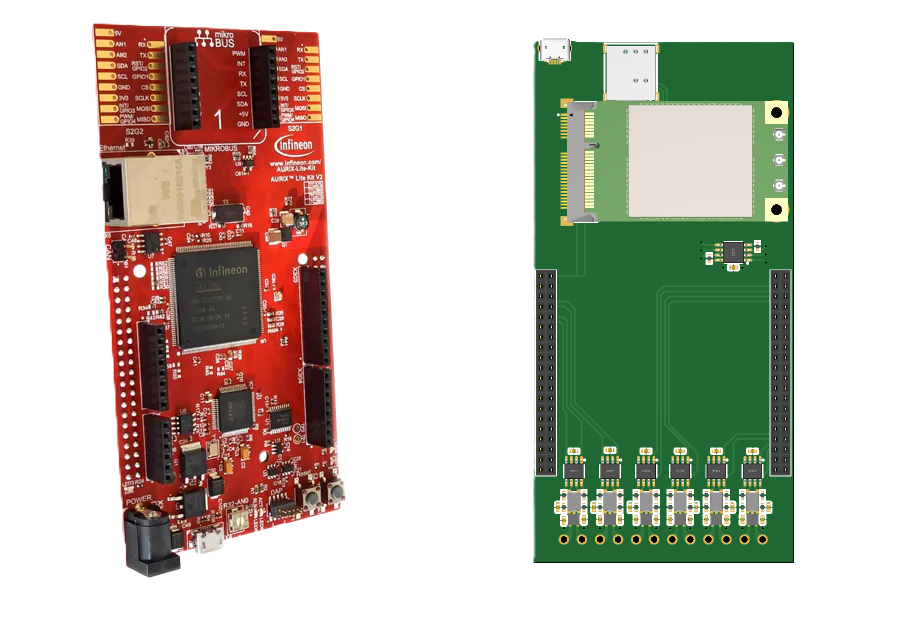

# TC375 RTOS Gateway Example

<p align="center">
  
</p>

## Project Overview

A multi-CPU RTOS system for the TC375 microcontroller featuring FreeRTOS on CPU0 and bare-metal compute nodes on CPU1/CPU2. This release demonstrates inter-CPU communication, button handling with debouncing, and coordinated LED control.

## Purpose

This project demonstrates and tests the hardware CAN FD gateway functionality on an Infineon TriCore TC375 device. A custom shield board is used to interface with the main development board, enabling evaluation of CAN FD communication and gateway capabilities in a real hardware setup.

## Quick Start

### Hardware Requirements
- TC375 Development Board
- BUTTON_0 connected to P00.7 (with pull-up)
- LED_1 connected to P00.5 (active low)
- LED_2 connected to P00.6 (active low)

### System Operation
1. **Power On**: System initializes, LED1 starts blinking every 100ms
2. **Button Press**: Press BUTTON_0 to toggle LED2 blinking process
3. **LED2 Behavior**: When active, LED2 blinks at 500ms intervals via CPU1/CPU2 coordination

## Purpose

This project demonstrates and tests the hardware CAN FD gateway functionality on an Infineon TriCore TC375 device. A custom shield board is used to interface with the main development board, enabling evaluation of CAN FD communication and gateway capabilities in a real hardware setup.

## Architecture Summary

### CPU0 - FreeRTOS Master
- **Init Task (1ms)**: Hardware setup and configuration
- **Button Task (10ms)**: Monitors P00.7 with 50ms debouncing
- **LED1 Task (100ms)**: Continuous LED1 toggling
- **User Tasks (1ms, 1000ms)**: Available for custom functionality

### CPU1 & CPU2 - Bare Metal Compute Nodes
- **CPU1**: Turns LED2 ON when `LED_PROCESS_ACTIVE` is true
- **CPU2**: Turns LED2 OFF when `LED_PROCESS_ACTIVE` is true
- **Coordination**: 500ms blink cycle through shared memory communication

## Key Features

### Button Handling
- **Hardware**: P00.7 with pull-up resistor (active low)
- **Debouncing**: 5-count threshold over 50ms (10ms × 5)
- **Function**: Toggles LED2 process on/off
- **Logic**: Single press detection prevents multiple toggles

### LED Control
- **LED1**: Continuous 100ms toggle (system heartbeat)
- **LED2**: Coordinated 500ms blink when process active
- **Both LEDs**: Active low logic (low = ON, high = OFF)

### Inter-CPU Communication
- **Shared Flags**: `LED_PROCESS_ACTIVE`, `BUTTON_PRESSED_FLAG`
- **Status Counters**: Loop counts and execution monitoring
- **Memory**: LMU-based shared variables for cross-CPU access

## Configuration

### Timing Parameters
```c
#define BUTTON_DEBOUNCE_COUNT   5          // 50ms debounce time
#define LED2_BLINK_PERIOD_US    500000     // 500ms LED2 blink period
```

### Pin Definitions
```c
#define BUTTON_0    IfxPort_P00_7    // Button input (pull-up)
#define LED_1       IfxPort_P00_5    // LED1 output (active low)
#define LED_2       IfxPort_P00_6    // LED2 output (active low)
```

## File Structure

### Core Files
- **App_Config.h**: System-wide configuration and declarations
- **App_Cpu0_Kernel.c**: FreeRTOS tasks and button/LED1 control
- **App_Cpu1_Compute.c**: CPU1 LED2 ON control logic
- **App_Cpu2_Compute.c**: CPU2 LED2 OFF control logic

### Main Files
- **Cpu0_Main.c**: CPU0 FreeRTOS initialization
- **Cpu1_Main.c**: CPU1 bare-metal main loop
- **Cpu2_Main.c**: CPU2 bare-metal main loop

## Current Implementation Details

### CPU0 FreeRTOS Task Schedule

| Task | Frequency | Function |
|------|-----------|----------|
| `task_cpu0_init` | 1ms | Hardware initialization, pin configuration |
| `task_cpu0_1ms` | 1ms | User functions placeholder |
| `task_cpu0_10ms` | 10ms | Button handling with debouncing |
| `task_cpu0_100ms` | 100ms | LED1 control and medium-frequency operations |
| `task_cpu0_1000ms` | 1000ms | User functions placeholder |

### Button Implementation
- **Physical Connection**: P00.7 with hardware pull-up
- **Active State**: Low (pressed = low, released = high)
- **Debouncing**: 5 consecutive readings at 10ms intervals (50ms total)
- **State Management**: `button_already_pressed` prevents multiple toggles
- **Action**: Toggles `LED_PROCESS_ACTIVE` flag

### LED Control Implementation
- **LED1**: Toggled every 100ms by CPU0 continuously
- **LED2**: Controlled by CPU1/CPU2 based on `LED_PROCESS_ACTIVE`
- **Blink Pattern**: 500ms ON (CPU1), 500ms OFF (CPU2)
- **Hardware**: Active low LEDs (low = ON, high = OFF)

## Build and Deploy

1. **Compile**: Build for TC375 target with appropriate toolchain
2. **Flash**: Program all three CPU cores
3. **Debug**: Use counters and flags for system monitoring

## Monitoring and Debug

### Status Variables
- `cpu0_*_count`: Task execution counters
- `cpu1_loop_count` / `cpu2_loop_count`: Compute node activity
- `led_process_count`: LED process execution tracking
- `button_debounce_count`: Current debounce counter value

### System States
- `LED_PROCESS_ACTIVE`: Main process control flag
- `BUTTON_PRESSED_FLAG`: Current button state (bool)
- `button_already_pressed`: Prevents multiple toggles per press
- `CPU*_EXECUTION_PROCESS`: Individual CPU status flags

### Expected System Behavior
1. **LED1**: Blinks continuously at 100ms intervals (system heartbeat)
2. **Button**: Pressing toggles LED2 process after 50ms debounce
3. **LED2**: Blinks at 500ms intervals when process is active
4. **Counters**: All task counters increment showing system activity

## Troubleshooting

### Common Issues
1. **LED1 Not Blinking**: Check CPU0 100ms task execution
2. **Button Not Responding**: Verify P00.7 connection and 10ms task
3. **LED2 Not Blinking**: Check `LED_PROCESS_ACTIVE` flag and CPU1/CPU2
4. **Multiple Toggles**: Verify `button_already_pressed` logic
5. **No Debouncing**: Check `button_debounce_count` increment

### Debug Steps
1. Monitor task execution counters
2. Check `BUTTON_PRESSED_FLAG` state changes
3. Verify `LED_PROCESS_ACTIVE` toggle on button press
4. Confirm CPU1/CPU2 loop counters increment
5. Test LED hardware connections

## Version Information

**Release Version**: Stable multi-CPU coordination with button control  
**Key Features**: 
- Button debouncing with single-press detection
- LED coordination between CPUs
- FreeRTOS integration with user task placeholders
- 500ms LED2 blink period
- Robust inter-CPU communication

**Target**: TC375 development boards  
**Status**: Production ready

For detailed architecture and development information, see [CLAUDE.md](CLAUDE.md).